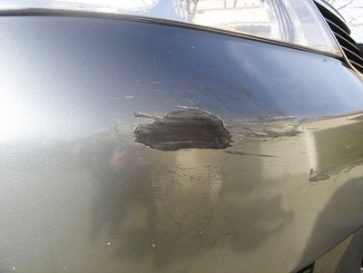
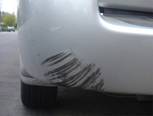
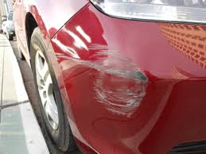
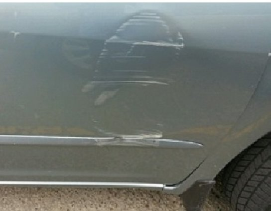
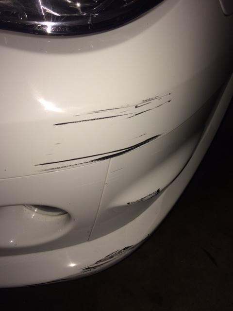

# Car Damage Detection and Segmentation using Mask R-CNN

This is a project of detecting damages from the images of car. The codes are based on implementation of Mask R-CNN by (https://github.com/matterport/Mask_RCNN) on Python 3, Keras, and TensorFlow. The model generates bounding boxes and segmentation masks for each instance of an object in the image. It's based on Feature Pyramid Network (FPN) and a ResNet101 backbone.

The repository includes:
* Source code of Mask R-CNN built on FPN and ResNet101.
* Instruction and Training code for Car Damage Detection
* Jupyter notebooks to visualize the detection pipeline at every step
* Example of training on your own dataset

# Examples

  
   

  
   

  
   

  
   

  
   

